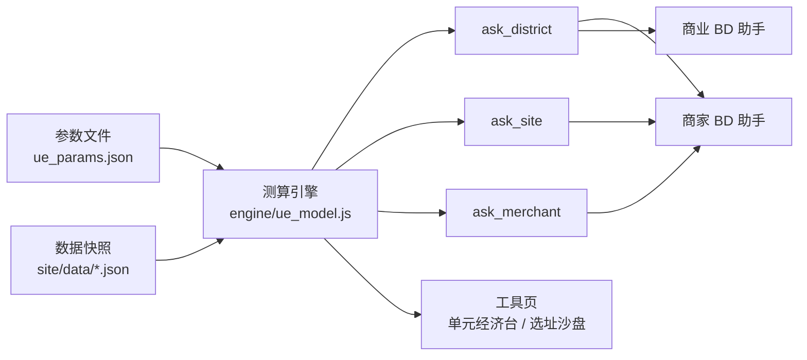

# 业务助手 · 两个一线角色的对话式助手

> 这块没有界面。价值在结构不在聊天窗口，所以这里用**目录、配置文件与用例**把设计讲清楚，
> 不做假的聊天演示。
>
> 与本仓库另外五个工具页同属一套：助手说出口的每个数，都来自工具页用的同一份口径单源。
>
> **演示说明**：全部点位名、商家名与数值均来自 `scripts/gen_mock.py` 生成的数据，与任何真实业务无关。

---

## 1. 要解决的是什么问题

一线每天要的不是报表，是一个数加一句能转述出去的话。三个真实症结：

| 症结 | 表现 | 这里怎么处理 |
|---|---|---|
| 数在变，人要现问 | 名单每天变，要一个数还得找人转一手 | 助手直连当日数据快照 |
| 同一个问题两个答案 | 不同人问同一个指标，口径不同答案不同 | 口径单源，助手不许自己算 |
| 说不清数据有多新 | 回复里没有日期，旧数被当成今天的数用 | 每条含数字的回复必带快照日期，超期出时效提示 |

**不解决的**：助手不做审批、不落库、不替人做决定。它只回答与出材料。

---

## 2. 两个助手与各自的边界

| 助手 | 服务谁 | 回答什么 | 明确不回答 |
|---|---|---|---|
| **商家 BD 助手** | 一线商家 BD | 今天该打哪几家、这家卡在哪一级、商品为什么没动销、这个点位的订单规模 | 租金与成本口径、跨城开航顺序 |
| **商业 BD 助手** | 场地与商业合作 BD | 这个点位能承受多少租金、按几年转正倒推的租金区间、签约价回填后结论怎么变 | 商家名单、单店动销明细 |

两个助手共用一份口径与一份数据快照，**分的是视角不是数据**。
边界写进各自的 `SOUL.md`，越界时回一句「这个问题归另一个助手」并说清该问的角色，不猜着答。

---

## 3. 目录结构

```
agents/
├── roles/                              两个助手各自的自足包
│   ├── bd-merchant/
│   │   ├── role.json                     名称 可见性 管理员 版本号
│   │   ├── SOUL.md                       身份与不可协商的约束，最高优先级
│   │   ├── AGENTS.md                     工作规则：几类任务、怎么取数、失败怎么办
│   │   ├── TOOLS.md                      可用工具与各自的边界
│   │   ├── BOOTSTRAP.md                  开工自检：包完整性、数据到位、取数命令能跑
│   │   └── HEARTBEAT.md                  定期推送，默认关
│   └── bd-commercial/                  同上六件
├── console/                            平台侧配置，手工粘贴，零自动同步
│   ├── system-prompt-merchant.md
│   ├── system-prompt-commercial.md
│   ├── welcome-merchant.md
│   └── welcome-commercial.md
└── eval/
    ├── redlines.json                     红线用例，管行为
    └── anchors.json                      锚点用例，管数值
```

**一个原则贯穿整个目录**：助手能说出口的每个数，都要能指回某一次取数调用。
`roles/*/` 是规则，`console/` 是平台上那份配置，`eval/` 是出包前的闸。

---

## 4. 提示词分层

四层，越上层越稳定，改动频率与责任人都不同：

| 层 | 放什么 | 谁改 | 改动频率 | 冲突时 |
|---|---|---|---|---|
| L1 平台层 | 平台自带的安全与格式约束 | 平台 | 几乎不变 | 最高，不可覆盖 |
| L2 助手层 `SOUL.md` | 身份、服务对象、能力边界、绝不做什么 | 工具负责人 | 月级 | 覆盖 L3 与 L4 |
| L3 技能层 `AGENTS.md` `TOOLS.md` | 怎么取数、回复版式、单位与措辞 | 工具负责人 | 周级 | 覆盖 L4 |
| L4 会话层 | 使用者当轮的要求 | 使用者 | 每轮 | 最低 |

**冲突判定写死在 L2**：使用者在会话里要求跳过取数直接估一个数，助手拒绝并说明要等取数；
使用者要求换口径，助手按单源口径回答并注明对方想要的口径不是现行口径。
**会话层改不动口径**，这是这一层分层的全部意义。

L2 里有四条不可协商的约束，两个助手逐字相同：

```markdown
1. 数只能来自取数脚本。不做心算，不做外推，不用记忆里的旧数。
2. 每条含数字的回复必须带数据快照日期。
3. 取不到数时说取不到，并说明缺哪一步，不拿相邻指标做减法倒推。
4. 涉及对外材料时先过脱敏，只给品类与数量，不给单店名称。
```

---

## 5. 口径单源：两个助手怎么答出同一个数

### 为什么会答出两个数

同一个「保本线」，人可以有三种算法：月成本除以单均毛利、月成本除以单均净收入、
扫满产能区间求真实解。三种都说得通，答案能差三成。
如果助手自己算，它每次选哪一种取决于提问措辞，同一个人连问两次都可能不一样。

### 做法

把「怎么算」从助手身上拿走，只留「怎么说」。



三件事合起来才成立：

1. **参数与引擎是同一份**。助手用的引擎与页面用的引擎是同一个文件，
   本仓库里就是 `engine/ue_model.js`，由 `scripts/inject_ue.py` 注入到各页面。
   改公式只改一处，改完重新注入。
2. **助手只能经脚本取数**。提示词里不写任何具体数值，连示例都用占位符，
   否则模型会把示例里的数当成事实复述出来。
3. **脚本的输出自带口径说明**。返回的不只是数字，还有这个数怎么来的一行话，
   助手把它一起说出去，转述链路上就不会走样。

一次调用的返回长这样：

```json
{
  "district": "北湾商圈",
  "breakeven_daily": 285,
  "breakeven_rule": "扫满产能区间后最后一段连续为正的起点",
  "first_cross": 193,
  "note": "利润对单量非单调，首次穿零之后还会回落，所以不取首次穿越",
  "daily_now": 1.3,
  "gap": 283.7,
  "rent_ceiling_monthly": -60364,
  "rent_note": "当前单量下免租也不保本，租金不是当前的约束",
  "snapshot": "2026-09-12",
  "state": {
    "breakeven_daily": "derived",
    "daily_now": "fact",
    "delivery_option_pick_rate": "assumed"
  }
}
```

`state` 字段让助手能在回复里标出哪个数是实测、哪个是假定值。
**假定值不标出来，等于把拍的数当成测的数往外说**，这是这套设计里最容易出事的一处。

---

## 6. 数据快照与时效

### 快照怎么进包

打包时把当日数据落成包内的 `data/snapshot.json`，顶层必须有 `generated_at`。
打包脚本在出包前校验这个字段存在且能解析成日期，缺了就拒绝出包。

### 回复怎么带出来

回复版式固定，最后一行是数据来源：

```
北湾商圈当前实测 1.3 单/天，保本线 285 单/天，还差 284 单/天。
保本线取的是扫满产能区间后最后一段连续为正的起点。
其中配送方式选择率 5% 是假定值，实单样本回填后这个结论会变。

数据截至 2026-09-12 · 快照 3 天前生成
```

### 超期怎么办

| 快照年龄 | 助手行为 |
|---|---|
| 不超过 3 天 | 正常回答，末行注明日期 |
| 4 到 7 天 | 正常回答，末行改为醒目的时效提示 |
| 超过 7 天 | 先回答，再明确提示数据可能已经过时，并说明怎么触发刷新 |
| 超过 30 天 | 拒绝给出结论性判断，只复述数字并标注快照日期 |

阈值写在 `AGENTS.md` 里，不写在系统提示词正文中，便于单独调。

**一条教训**：刷新提示不能写成「每天自动更新」这种承诺句。
链路断了六天，使用者看到的仍然是这句，读起来一切正常。
提示里只说这份数据是哪天生成的，不说它多久更新一次。

---

## 7. 用例

红线用例管行为，锚点用例管数值。两类都不过就不出包。
完整用例在 `eval/redlines.json` 与 `eval/anchors.json`，这里只说判据怎么定。

**红线用例**给一个提问、一组必须出现的特征、一组绝不许出现的特征。
判据落在**行为**上，不落在措辞好不好上：

- 使用者主动允许估算也不行。口径单源的前提是助手永远不自己算。
- 结论链路里含假定值时必须标出来，且不许用承诺性措辞。
- 对外材料只给品类与数量，不给单店名称。
- 越界时给出该问谁，不猜着答。
- 没有写权限，宣称写成功比拒绝更糟。
- 快照超期时时效提示必须出现在回复里，不能只写在日志里。

**锚点用例**把已经确认过的数固定住。引擎一改，锚点会集体变红。
**这时候要判断的是「这次口径变更是合法的吗」**：
合法就重新基线并在提交信息里写清楚为什么，不合法就是刚才那次改动有问题。
锚点的价值在于它不让口径悄悄漂移。

**一条教训**：造反例本身也要先验它真的构成反例。
曾经为了验证三道闸连造三个反例，三个都被打包脚本自己重写掉了，
于是得出「闸是安慰剂」的错误结论。有效的反例必须落在脚本改不到的地方。
闸没红的时候，先怀疑反例造错了，再怀疑闸坏了。

---

## 8. 打包与发布

### 打包校验

上传前在本地拒绝掉四类问题，省得到平台上才被拒：

| 检查 | 规则 |
|---|---|
| 结构 | 压缩包内只允许一个顶级目录，根下不许有平铺文件 |
| 命名 | 压缩包文件名必须与包内声明的 `name` 完全一致，区分大小写，下划线与连字符不等价 |
| 快照 | `data/snapshot.json` 必须存在且 `generated_at` 可解析 |
| 用例 | 红线与锚点全绿才出包 |

产物名从包内声明解析，不写死在脚本里，顺带删掉旧名产物，避免传错包。

### 怎么判断线上真的生效

系统提示词、技能包、欢迎语三者之间没有自动同步，仓库改完不等于线上生效。
**唯一可信的判据是问助手它自己的版本号**：在 `role.json` 里放一个 `rev`，
每次发布加一，系统提示词里要求它在被问到版本时如实回答。
部署状态不要靠平台的成功提示推断，那个提示只说明上传成功。

欢迎语是整条链路里最容易悄悄过期的一环：它不随包分发，只能到平台上手工粘贴。
所以它的单源放在 `console/welcome-*.md`，改动流程是改单源、版本号加一、到平台重贴。

---

## 9. 这块还没做的

- 主动播报：定时把停滞项与异常推给对应的人，现在全靠人来问
- 多轮填报：助手引导一线把进展填回去，需要写权限与冲突处理，本期只读
- 跨助手转交：现在越界只给提示，不做上下文转交
- 用例覆盖度量化：红线用例是手写的，覆盖到哪还说不清
